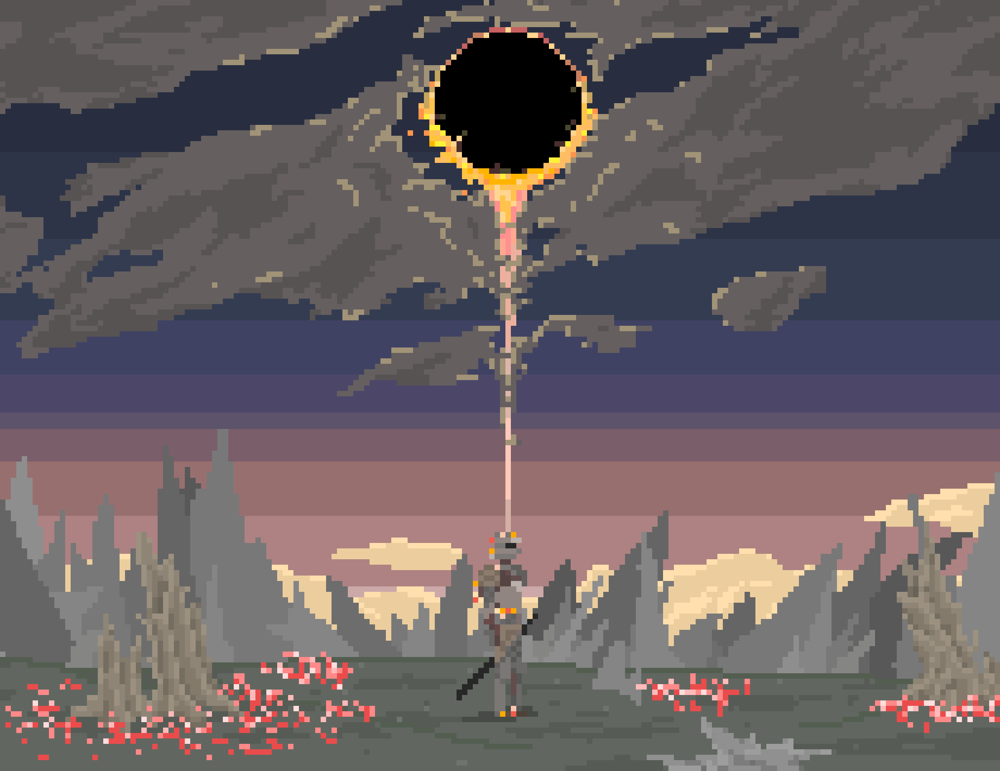

<h1 align="center">ammarsjw</h1>

## About Me

👀 My name is Ammar Salahuddin

🔭 I am a blockchain and backend developer

🌱 I started in 2022 with Solidity and NodeJS, making simple smart contracts and expanding my knowledge

👓 Over time I gained expertise in blockchain technologies and grasped concepts as simple as DeFi codebases to as complex as Zero Knowledge architectures

💬 Willing to contribute and learn in Web2 and Web3

 My goal is to one day work on my own souls-like project

## Contact me

	
    
	

## Programming Languages

	
	
	

